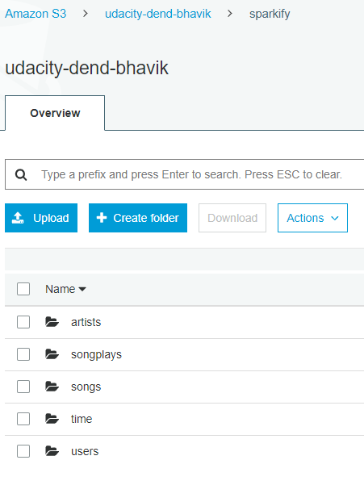

# Data Lake for Sparkify

This project aims at creating data lake for `Sparkify` startup company. This data lake will provide ad-hoc analytical capabilities to analyze songplay data by their users.

## Table of Contents

- [Technologies used](#Technologies-used)
- [Source data information](#Source-data-information)
- [File Details](#File-Details)
- [ETL Processing](#ETL-Processing)
- [Project Files](#Project-Files)
- [Target Files on S3](#Target-Files-on-S3)
- [References](#References)

## Technologies used

- Pyspark
- AWS S3

## Source data information

There are two set of source files available for processing. `song_data` and `log_data`.
both the datasets are present on AWS S3 buckets.
* song_data is present at 's3://udacity-dend/song_data/'
* log_data is present at 's3://udacity-dend/log_data/'

### song_data
set of files that contains metadata about songs.
- single file contains metadata about a single song.
- json format.
- sample data:

### log_data
set of files that contains transactional data about the songs played in the app by various users.
- single file contains transactional data for a given day. a list of json data records are present in the file.
- json format.
- sample data:

## File Details 
    
    5 data files are created on Amazon S3 location - from the log_data and song_data file.
    The processed files are stored in parquet file format. Columnar storage allows for faster scanning on large datasets.

    `SONGPLAYS` file contain the list of songs played by the users of the Sparkify app.
        - file location 's3a://udacity-dend-bhavik/sparkify/songplays/'
    `TIME` file contain details about each timestamp (viz. date, dayofweek, month, year, etc.) which is useful for slicing and dicing the songplay data.
        - file location 's3a://udacity-dend-bhavik/sparkify/time'
    `SONGS` file contain metadata about the songs.
        - file location 's3a://udacity-dend-bhavik/sparkify/songs'
        - data is partitioned by 'year' and 'artist_id'.
    `ARTISTS` file contain the metadata about the artists related to the songs.
        - file location 's3a://udacity-dend-bhavik/sparkify/artists'
    `USERS` file contain metadata about the users of the app. It contains the latest details about the users.
        - file location 's3a://udacity-dend-bhavik/sparkify/users'

## ETL Processing

### Data Profile:

* songs and artists files are populated from the `song_data` source file. 
* Data profiled shows that `year, artist_location, artist_latitude and artist_longitude` are not always present. 
* An Artist could have multiple songs. some song_names have special characters in the source file encoded in utf8 format and target database is set to the same in order to preserve data accuracy. 
* Users, time and songplay files are populated from the `log_data` source file(except for user_id and artist_id which are linked from songs file).
* A user could have multiple songplays.

### Data Processing
* Data from both the datasets (log_data and song_data) are loaded into pyspark dataframes.
* Records from `log_data` are filtered on page=='NextSong'. these are the records which contain only the songplay log information which needs to be populated.
* Required transformations are done on the pyspark dataframes before they are written to S3 parquet files.

## Project Files
    `etl.py` contains code for using the source JSON files and performing transformations before finally loading the parquet files in AWS S3 location.
    `dl.cfg` contains the congfiguration access keys for AWS.

## Target Files on S3

Below is the screenshot of the files created at S3 location post processing.

## References

* https://stackoverflow.com/questions/36822224/what-are-the-pros-and-cons-of-parquet-format-compared-to-other-formats
* https://spark.apache.org/docs/2.3.0/sql-programming-guide.html#save-modes
* https://spark.apache.org/docs/latest/api/python/pyspark.sql.html?highlight=join#pyspark.sql.DataFrame.join